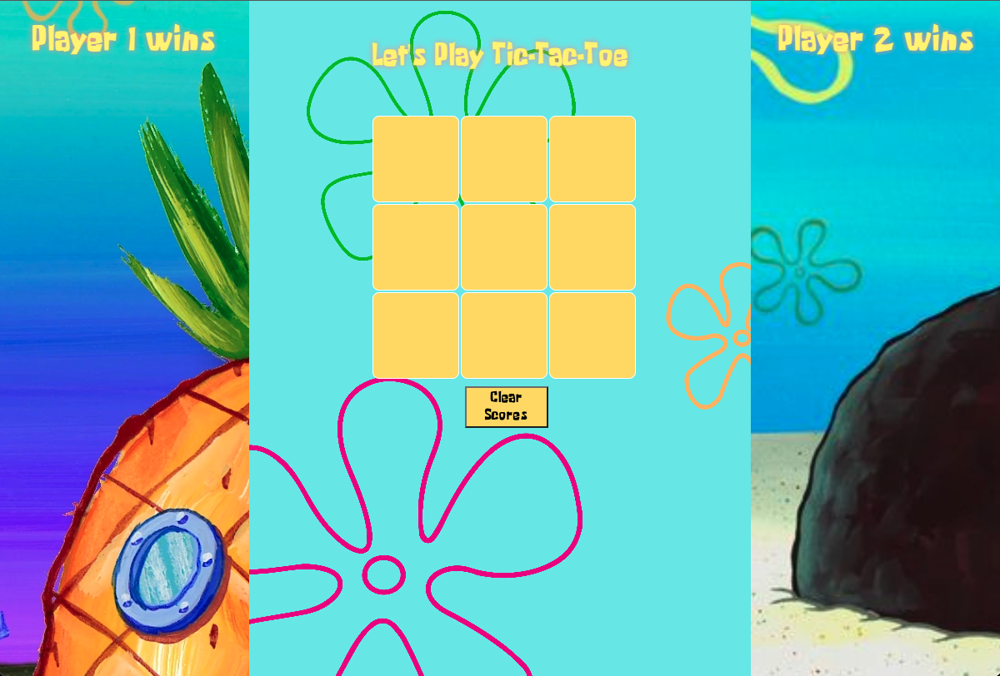

# Tic-Tac-Toe

## Table of Contents
- [Overview](#Overview)
- [Setup](#Setup)
- [ScreenShots](#ScreenShots)
- [Features](#Features)
- [Links](#Links)
- [Contributors](#Contributors)
- [Technologies](#Technologies)

## Overview
This application is a chance for students to build a Tic-Tac-Toe app that allow users to play a game of tic-tac-toe. This Solo Challenge gave us a chance to show where we are with the foundational concepts of the Mod 1 curriculum. In this challenge, we utilized HTML, CSS, and JavaScript to create a functional app that will use game logic to play a game. I used the data model to display and update the DOM.

## Setup
- Clone this repository down to your local machine
- Navigate into the tic-tac-toe directory
- Run open index.html in the terminal to interact with the application

## Screenshots

Example Screenshot 
  

Functionality 
  

## Features
- The game keeps tracks of the score and stores the data in local localStorage
- The game displays which player turn it is, if they are winner, and if the game is a draw

## Links
- The spec for this project can be found [here](https://frontend.turing.edu/projects/module-1/tic-tac-toe-solo-v2.html).

## Contributors
- [Hazel Pablo](https://github.com/Hpablo08?tab=repositories)

## Technologies
  - Javascript
  - HTML
  - CSS
